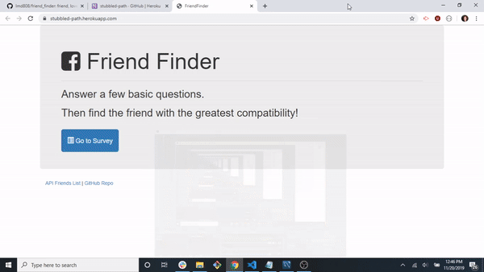
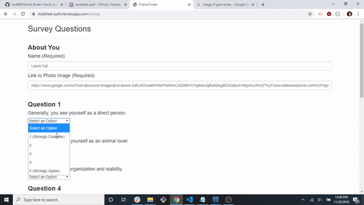
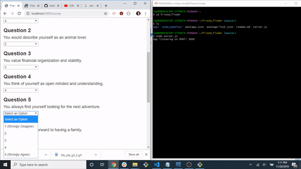
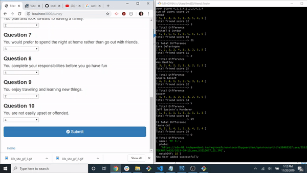

# Friend Finder- Helping you find your new Best Friend

## Problem:
There are so many people in this would, but which one should you be friends with? Friend finder allows you to find the closest friend match possible.

## Technologies: 
* [Javascript](https://www.javascript.com/) - The scripting language used to manipulate the DOM. 
* [Heroku](https://www.heroku.com/)- Cloud platform which builds databases and websites deployed online. 
* [Node](https://nodejs.org/en) - Javascript run-time environment (used to execute server side code.)
* [Express](https://www.npmjs.com/package/express) - Node package used as middleware to create routes.
* [ExpressHandleBars](https://www.npmjs.com/package/handlebars) - Node package used as middleware to create page templates. 
* [HTML5](https://developer.mozilla.org/en-US/docs/Web/Guide/HTML/HTML5) - Mark up language used for structuring pages. 
* [BootStrap](https://getbootstrap.com/) - popular framework for building responsive websites
* [CSS](https://developer.mozilla.org/en-US/docs/Web/CSS) -is a stylesheet language used to describe the presentation of a document written in HTML or XML
* [Sequelize](https://sequelize.org/) - Sequelize is a promise-based Node.js ORM for Postgres, MySQL, MariaDB, SQLite and Microsoft SQL Server. 
* [SQL](https://developer.mozilla.org/en-US/docs/Glossary/SQL) - SQL is a standard language for storing, manipulating and retrieving data in databases.

## Site Demo: 
Below are gifs capturing the functionality of my Friend Frindr application
 
 

## CLI Demo
The below gifs offer some insight into what is happening in the background of my application. Many of the console logs will be removed to clean it up. They are mainly there to provide insight. 
 

## Link to Live Version: 
[Heroku Link](https://ichef.bbci.co.uk/news/660/media/images/67617000/jpg/_67617336_hi-its-god-here.jpg)
## Link to GitHub Repo:
[Repo Link](https://github.com/lmd808/friend_finder)

## Creator: 

Laura DiTommaso [GitHub](https://github.com/lmd808)
