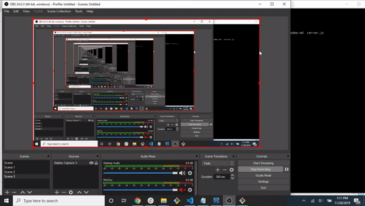

# Friend Finder- Helping you find your new Best Friend

## Problem:
There are so many people in this would, but which one should you be friends with? Friend finder allows you to find the closest friend match possible.

## Site Demo: 
Below are gifs capturing the functionality of my Friend Frindr application
 
 

## CLI Demo
The below gifs offer some insight into what is happening in the background of my application. Many of the console logs will be removed to clean it up. They are mainly there to provide insight. 
 

## Link to Live Version: 
[Heroku Link](https://ichef.bbci.co.uk/news/660/media/images/67617000/jpg/_67617336_hi-its-god-here.jpg)
## Link to GitHub Repo:
[Repo Link](https://github.com/lmd808/friend_finder)

## Creator: 

Laura DiTommaso [GitHub](https://github.com/lmd808)
